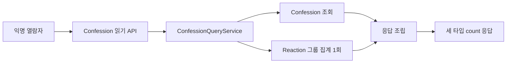
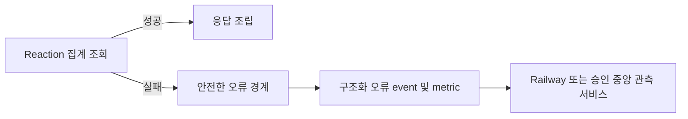

# UOW-CONFESSION-REACTION-INTEGRATION Deployment Architecture

## 읽기 배치 구조

## 장애와 관측 흐름

## 배포 전제

- read replica, 별도 query 서비스, queue 또는 장애 복구 store를
  MVP에 추가하지 않는다.
- demo 데이터 초기화는 허용된 preview 제약이다.
- 중앙 관측 서비스의 보존 및 경보 기준은 영속 production 전환 전
  증빙한다.
