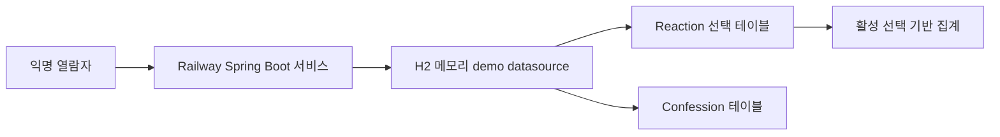

# UOW-REACTION Deployment Architecture

## 배치 구조

## 실행 흐름

1. 공개 Reaction endpoint가 허용 타입과 요청 식별을 검증한다.
2. 공통 보안 필터가 파생 기기 key와 요청 제한을 적용한다.
3. use case가 자기 고해 여부를 확인하고 Reaction 선택 테이블을
   갱신한다.
4. 데이터베이스 유일 제약이 동시에 도착한 선택의 중복을 차단한다.
5. 읽기 경로는 활성 선택 행을 집계해 Confession 응답에 포함한다.

## 배포 전제

- 신규 database나 메시징 서비스는 추가하지 않는다.
- 전용 demo profile은 H2 console과 SQL 출력을 비활성화한다.
- demo 데이터는 재시작 또는 재배포 때 초기화될 수 있다.
- 영속 production으로 전환할 때 storage TLS와 저장 암호화 설계를
  별도로 승인받아야 한다.
