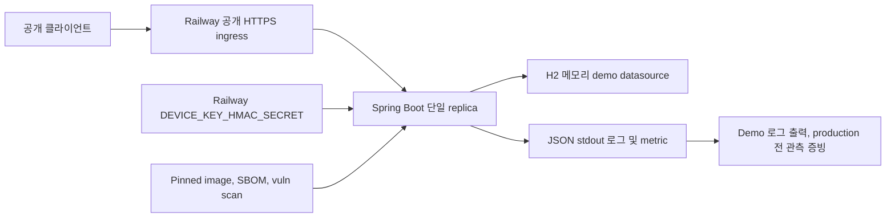

# UOW-SECURITY Deployment Architecture

<!-- markdownlint-disable MD060 -->

## 보안 배치 구조

## 신뢰 경계

| 경계 | 적용 통제 | 필요한 외부 증빙 |
| ---- | --------- | ---------------- |
| 공개 ingress에서 애플리케이션 | demo HTTPS 사용 | production 전 Railway ingress access logging/network 증빙 |
| 애플리케이션 내부 | HMAC, throttling, validation, 안전 오류, 헤더 | 코드 및 테스트 결과 |
| 애플리케이션 내부 저장소 | H2 console/SQL 출력 비활성화 | demo profile 테스트와 데이터 초기화 고지 |
| 애플리케이션에서 관측 저장소 | 민감정보 없는 구조화 로그 | production 전 중앙 수집, 불변성, 보존, 경보 설정 |
| 빌드에서 실행 이미지 | digest 고정과 취약점 검사 | lock/verification, SBOM, scan 결과 |

## Scale 제한

- demo는 단일 instance 전제에서만 in-memory limiter의 전체 제한
  일관성을 보장한다.
- replica를 늘리기 전 shared rate-limit store로 변경하는 승인된
  Infrastructure Design이 필요하다.
