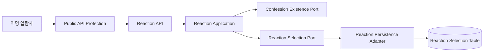
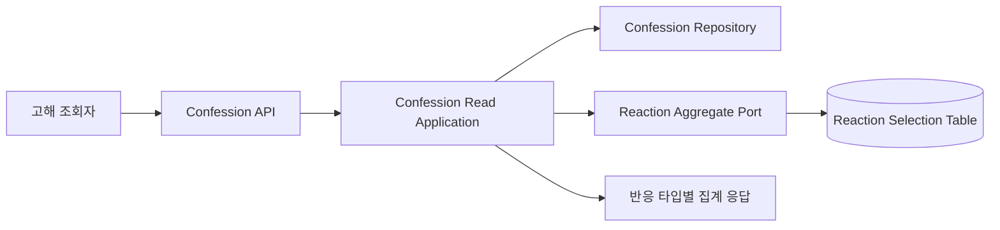

# 고해 반응 Component Dependency

<!-- markdownlint-disable MD060 -->

## 의존성 원칙

- HTTP 구성 요소는 application use case에 의존하며 영속성 구현을 직접
  참조하지 않는다.
- Reaction application은 대상 고해 확인을 위해 Confession domain
  port를 읽기 전용으로 사용한다.
- Confession 읽기 application은 Reaction aggregate port를 통해
  집계만 받으며 기기별 선택 데이터에 접근하지 않는다.
- JPA entity와 Spring Data repository는 infrastructure adapter 뒤에
  남는다.
- 보안 증빙은 기능 도메인의 런타임 의존성이 아니라 단계 완료 판정의
  검증 의존성이다.

## 의존성 행렬

| 소비자 | 제공자 | 의존 목적 | 형태 |
| ------ | ------ | --------- | ---- |
| Reaction API | Public API Protection | 요청 제한 및 공통 보호 | HTTP filter/interceptor 선행 |
| Reaction API | Reaction Application | 선택 및 해제 실행 | use case 호출 |
| Reaction Application | Confession Domain Port | 대상 고해 존재 확인 | 동기 읽기 port |
| Reaction Application | Reaction Domain Port | 선택/해제 상태 반영 | 동기 쓰기 port |
| Reaction Persistence | Database | 선택 행과 유일성 보장 | JPA adapter |
| Confession Read Application | Reaction Aggregate Port | 타입별 활성 집계 | 동기 읽기 port |
| Reaction Aggregate Adapter | Database | 집계 파생 | JPA 조회 |
| Build and Test 판정 | Operational Evidence | 운영 보안 준수 확인 | 체크리스트/증빙 |
| Build and Test 판정 | Supply Chain Evidence | SBOM/검사 준수 확인 | 실행 결과/증빙 |

## 선택 및 해제 데이터 흐름

## 조회 집계 데이터 흐름

## Security Baseline 추적

| Baseline 항목 | Application Design 책임 | 후속 상세화 단계 |
| ------------- | ----------------------- | ---------------- |
| `SECURITY-01` | Operational Evidence가 TLS/저장 암호화 증빙을 요구 | Infrastructure Design, Build and Test |
| `SECURITY-03` | Application Observability가 원문 device ID 비기록과 구조화 로깅을 요구 | NFR Design, Code Generation |
| `SECURITY-04` | Public API Protection이 HTTP 보안 헤더 경계를 담당 | NFR Design |
| `SECURITY-05` | API 및 application 입력 검증 경계를 명시 | Functional Design, Code Generation |
| `SECURITY-08` | 집계만 공개하고 기기 선택 내역을 노출하지 않음 | Functional Design, Test |
| `SECURITY-09`, `SECURITY-15` | 안전한 오류와 hardening 경계를 둠 | NFR Design, Code Generation |
| `SECURITY-10` | Supply Chain Evidence가 SBOM/검사 결과를 요구 | NFR Design, Build and Test |
| `SECURITY-11` | 내부 rate limiting 구성 요소를 둠 | NFR Design, Code Generation |
| `SECURITY-13` | 유일성 제약 및 집계 파생 무결성을 요구 | Functional Design, Test |
| `SECURITY-14` | 외부 로그/보존/경보/대시보드 증빙을 요구 | Infrastructure Design, Build and Test |

`SECURITY-02`, `SECURITY-06`, `SECURITY-07`, `SECURITY-12`는 운영 구성 및
인증 범위를 조사한 뒤 NFR 또는 Infrastructure Design에서 적용 여부와
증빙 또는 `N/A` 근거를 판정한다.
