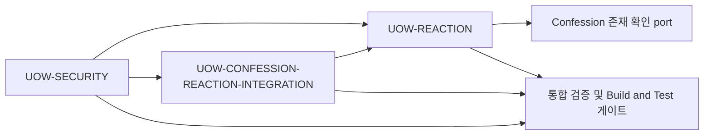

# Unit Of Work Dependency

## Units

- **UOW-1**: Anonymous Confession Write Flow

## Dependency View

UOW-1 is a single delivery unit. Dependencies below are internal collaborators
or implementation dependencies inside the existing backend.

- **`confession/api`**: Accept device id and write request data.
- **`confession/application`**: Orchestrate confession write behavior.
- **`author/application`**: Lookup or create anonymous author.
- **Domain repository ports**: Keep application persistence direction.
- **Infrastructure persistence adapters**: Persist existing author and
  confession data.

## Dependency Rules

- The controller depends on the confession application boundary, not on a write
  command value object constructor.
- Confession application behavior may use author application behavior to obtain
  the anonymous author identity.
- Application code depends on domain repository ports.
- JPA entities and Spring Data repositories remain implementation details in
  infrastructure.

## Coordination Notes

- No cross-unit release sequencing is required because UOW-1 is delivered as
  one backend unit.
- A verification checkpoint is still required after the write use case boundary
  changes so controller and application tests agree on the new call shape.

## 활성 변경: 고해 반응 MVP 의존성

### 단위

- **`UOW-REACTION`**: 익명 반응 선택/해제, 반응 선택 저장,
  Reaction aggregate port 제공.
- **`UOW-CONFESSION-REACTION-INTEGRATION`**: 기존 Confession 조회
  응답과 반응 집계 통합.
- **`UOW-SECURITY`**: 공통 보안 제어, 운영 및 공급망 증빙, 최종
  보안 완료 판정.

### 의존성 뷰

### 의존성 규칙

- `UOW-REACTION`은 기존 Confession 저장 구현을 소유하지 않고 대상
  고해 존재 확인 port만 사용한다.
- `UOW-CONFESSION-REACTION-INTEGRATION`은 Reaction 선택 행을 직접
  읽지 않고 `UOW-REACTION`이 제공하는 aggregate port를 소비한다.
- `UOW-SECURITY`는 기능 도메인 저장 의미를 바꾸지 않으며 공통 HTTP
  보호, 안전한 관측/오류 경계와 보안 증빙 판정을 담당한다.
- 세 단위는 하나의 배포 단위 안에서 병행 작업할 수 있지만, 최종
  검증은 `UOW-SECURITY`의 차단 조건 판정 없이 완료될 수 없다.

### 전달 순서

1. `UOW-REACTION`은 선택 저장 및 aggregate port 계약을 상세 설계한다.
2. `UOW-CONFESSION-REACTION-INTEGRATION`은 aggregate port 계약에 맞춰
   Confession 조회 결합을 상세 설계한다.
3. `UOW-SECURITY`는 두 기능 단위에 적용될 공통 보호와 증빙 판정
   방식을 상세 설계한다.
4. 구현은 병행 가능하지만 세 단위의 통합 검증과 Build and Test
   승인은 보안 증빙 판정 이후에 수행한다.

### Security Baseline 배정

- `UOW-REACTION`: `SECURITY-05`, `SECURITY-08`, `SECURITY-13`의
  Reaction 데이터와 API 관련 책임.
- `UOW-CONFESSION-REACTION-INTEGRATION`: `SECURITY-08`,
  `SECURITY-13`의 조회 비노출 및 집계 무결성 책임.
- `UOW-SECURITY`: `SECURITY-01`, `SECURITY-03`, `SECURITY-04`,
  `SECURITY-09`, `SECURITY-10`, `SECURITY-11`, `SECURITY-14`,
  `SECURITY-15`와 적용 여부를 조사할 나머지 기준의 판정 책임.
