# 고해 반응 MVP 실행 계획

<!-- markdownlint-disable MD060 -->

## 상세 분석 요약

### 변경 범위

- **변경 유형**: 사용자 기능 추가와 전체 Security Baseline 준수 보완을
  함께 수행하는 brownfield 확장.
- **기능 변경**: 기존 Reaction 카운터 증가 동작을 기기별 멱등
  선택/해제와 타입별 집계 조회로 교체한다.
- **보안 변경**: 사용자가 선택한 전체 Security Baseline의 차단
  finding을 해소하거나 적용 불가 근거를 검증 가능한 산출물로 남긴다.
- **관련 구성 요소**: `confession` 계층 전체, `common` 보안/오류
  처리, 데이터베이스 구성, 배포와 로그/모니터링 증빙, 공급망 자동화,
  테스트와 문서.

### 영향 평가

- **사용자 영향**: 있음. 익명 열람자가 허용된 지지 반응을 선택하고
  해제하며 집계를 확인한다.
- **구조 영향**: 있음. 반응 선택 도메인과 보안 제어 경계, 운영 증빙
  경계를 설계해야 한다.
- **데이터 모델 영향**: 있음. 별도 반응 선택 테이블에
  `(confession_id, device_id, reaction_type)` 유일성이 필요하다.
- **API 영향**: 있음.
  `PUT`/`DELETE /api/confessions/{confessionId}/reactions/{type}`와
  입력 검증, 제한 응답을 제공한다.
- **NFR 영향**: 큼. 전체 보안 규칙, PBT, 배포/운영 및 공급망 검증이
  차단 조건이다.

### 구성 요소 관계

- **기능 중심**: `confession/api` -> `confession/application` ->
  `confession/domain` -> `confession/infrastructure`.
- **교차 절단 보안**: API 검증, 안전한 로깅/오류, throttling,
  HTTP 보안 설정, CORS 정책.
- **배포 및 운영**: 데이터베이스 TLS/저장 암호화 증빙, 중앙 로그,
  로그 보존/경보/대시보드.
- **공급망**: 의존성 고정, 취약점 검사, SBOM, 이미지/CI 무결성.
- **테스트**: 예제 기반 API 테스트와 PBT 기반 상태 불변식 검증.

### 위험 평가

- **위험 수준**: 높음
- **근거**: 공개 변이 API, 익명 식별 데이터, 저장 의미 변경에 더해
  기존 시스템 전반의 보안 준비 상태까지 완료 조건에 포함된다.
- **롤백 복잡도**: 중간 이상. 기능 데이터 전환과 보안/운영 설정
  변경이 분리되어야 한다.
- **테스트 복잡도**: 높음. API 동작, 데이터 무결성, abuse control,
  PBT, 공급망 및 운영 증빙을 함께 검증한다.

## Security Baseline 결정

사용자는 Workflow Planning 확인 질문에 `A`로 답하여 전체 Security
Baseline을 이번 실행의 차단 조건으로 유지했다. 따라서 관련 finding을
해결하거나 규칙상 적용 대상이 아님을 증명하기 전에는 Code Generation
및 Build and Test 완료를 승인 가능한 상태로 보고하지 않는다.

### 현재 확인된 차단 또는 확인 필요 항목

| 규칙          | 계획에 포함할 확인 또는 보완 항목                              |
| ------------- | --------------------------------------------------------------- |
| `SECURITY-01` | PostgreSQL 저장/전송 암호화와 TLS 연결 설정 또는 운영 증빙      |
| `SECURITY-03` | 원문 기기 ID 로그 제거, 구조화 로그와 중앙 수집 증빙            |
| `SECURITY-04` | HTML 제공 endpoint 존재 여부 및 필요한 HTTP 보안 헤더           |
| `SECURITY-05` | 모든 영향 API 입력의 길이, 형식, allowlist 및 요청 크기 검증    |
| `SECURITY-08` | 공개 익명 endpoint 명시와 자원/기기 정보 비노출                |
| `SECURITY-09` | production 오류 및 불필요한 노출 surface 점검                  |
| `SECURITY-10` | lock 또는 버전 고정, 취약점 검사, SBOM, 이미지 고정             |
| `SECURITY-11` | 공개 API rate limiting과 abuse scenario 설계                   |
| `SECURITY-13` | 반응 변경의 감사 가능성 및 데이터 무결성 보장                   |
| `SECURITY-14` | 로그 보존, 경보 및 모니터링 대시보드 증빙                       |
| `SECURITY-15` | 안전한 전역 오류 처리와 외부 저장소 실패 경로 검증              |

`SECURITY-02`, `SECURITY-06`, `SECURITY-07`, `SECURITY-12`는 배포 및
인증 구성 조사 뒤 실제 구성 요소가 없다면 `N/A` 근거를 문서화한다.

### Railway H2 Demo 범위 변경

사용자는 Infrastructure Design 중 실제 우선 배포 환경이 Railway의
H2 기반 preview이며 기능을 먼저 확인하는 목적이라고 명시했다. 이후
변경 질문에서 다음 범위를 승인했다.

- 첫 배포는 production 출시가 아닌 데이터 유실 허용 demo preview다.
- H2 메모리 database를 사용하는 전용 demo profile을 제공하고,
  H2 console과 SQL 출력은 공개 demo에서 비활성화한다.
- 입력 검증, raw device ID 비로그, 안전 오류, throttling, 보안
  헤더, API docs 비노출, PBT 및 공급망 검증은 demo 구현 게이트로
  유지한다.
- 관리형 저장 암호화, 중앙 로그 90일 보존, 보안 경보와 dashboard
  같은 운영 증빙은 영속 production 전환 전의 차단 게이트로
  이월한다. 이 이월은 demo가 production 준수 상태임을 뜻하지 않는다.

## Property-Based Testing 결정

Property-Based Testing 확장도 활성 상태를 유지한다.

- 선택과 해제의 멱등성을 검증한다.
- 선택 순서와 무관하게 기기/고해/타입 중복이 없고 집계가 활성 선택과
  일치함을 상태 기반 속성으로 검증한다.
- 입력 타입 직렬화/역직렬화가 추가되면 왕복 속성을 검증한다.
- NFR Requirements에서 Kotlin용 PBT 프레임워크, shrinking, seed
  재현 및 CI 실행 방식을 선정한다.
- 예제 기반 테스트는 핵심 사용자 시나리오를 별도로 유지한다.

## 워크플로우 시각화

```mermaid
flowchart TD
    Start(["Reaction MVP and security request"])

    subgraph INC["INCEPTION"]
        WD["Workspace Detection<br/>COMPLETED"]
        RE["Reverse Engineering<br/>REUSED"]
        RA["Requirements Analysis<br/>COMPLETED"]
        US["User Stories<br/>COMPLETED"]
        WP["Workflow Planning<br/>COMPLETED"]
        AD["Application Design<br/>EXECUTE"]
        UG["Units Generation<br/>EXECUTE"]
    end

    subgraph CON["CONSTRUCTION"]
        FD["Functional Design<br/>EXECUTE"]
        NR["NFR Requirements<br/>EXECUTE"]
        ND["NFR Design<br/>EXECUTE"]
        ID["Infrastructure Design<br/>EXECUTE"]
        CG["Code Generation<br/>EXECUTE"]
        BT["Build and Test<br/>EXECUTE"]
    end

    Start --> WD --> RE --> RA --> US --> WP --> AD --> UG --> FD --> NR
    NR --> ND --> ID --> CG --> BT --> End(["Complete"])

    style WD fill:#4CAF50,stroke:#1B5E20,stroke-width:3px,color:#fff
    style RE fill:#4CAF50,stroke:#1B5E20,stroke-width:3px,color:#fff
    style RA fill:#4CAF50,stroke:#1B5E20,stroke-width:3px,color:#fff
    style US fill:#4CAF50,stroke:#1B5E20,stroke-width:3px,color:#fff
    style WP fill:#4CAF50,stroke:#1B5E20,stroke-width:3px,color:#fff
    style AD fill:#FFA726,stroke:#E65100,stroke-width:3px,color:#000
    style UG fill:#FFA726,stroke:#E65100,stroke-width:3px,color:#000
    style FD fill:#FFA726,stroke:#E65100,stroke-width:3px,color:#000
    style NR fill:#FFA726,stroke:#E65100,stroke-width:3px,color:#000
    style ND fill:#FFA726,stroke:#E65100,stroke-width:3px,color:#000
    style ID fill:#FFA726,stroke:#E65100,stroke-width:3px,color:#000
    style CG fill:#4CAF50,stroke:#1B5E20,stroke-width:3px,color:#fff
    style BT fill:#4CAF50,stroke:#1B5E20,stroke-width:3px,color:#fff
    style Start fill:#CE93D8,stroke:#6A1B9A,stroke-width:3px,color:#000
    style End fill:#CE93D8,stroke:#6A1B9A,stroke-width:3px,color:#000
```

텍스트 대안:

1. 완료된 요구사항과 Reaction 사용자 스토리를 입력으로 사용한다.
2. Reaction 기능 및 보안 책임 경계를 위해 Application Design을
   실행한다.
3. 기능 전달 단위와 보안/운영 준비 단위를 정의하기 위해 Units
   Generation을 실행한다.
4. 각 단위에서 Functional Design, NFR Requirements, NFR Design,
   Infrastructure Design을 실행한다.
5. 모든 차단 finding에 대한 설계가 승인된 뒤 코드와 구성 변경을
   수행하고, Build and Test에서 증빙을 검증한다.

## 실행 단계

### Inception Phase

- [x] Workspace Detection - 기존 brownfield 저장소와 완료 산출물을
  재사용했다.
- [x] Reverse Engineering - 기존 Reaction 초기 구현과 보안 관련
  코드/구성 근거를 조사했다.
- [x] Requirements Analysis - Reaction API, 저장 모델, Security
  Baseline 및 PBT 요구사항을 승인받았다.
- [x] User Stories - `US-2` 선택/해제와 `US-3` 집계 조회를
  승인받았다.
- [x] Workflow Planning - 전체 보안 차단 범위를 반영한 실행 계획을
  작성했다.
- [ ] Application Design - EXECUTE
  - **근거**: 새 Reaction 상태 서비스와 전역 보안/운영 책임을
    구성 요소와 인터페이스로 먼저 분리해야 한다.
- [ ] Units Generation - EXECUTE
  - **근거**: 기능 전달과 보안 준비 상태 변경의 책임, 종속성,
    검증 순서를 명시해야 한다.

### Construction Phase

- [ ] Functional Design - EXECUTE
  - **근거**: 반응 선택 집합 규칙, 집계 파생, 감사 가능성 및 PBT
    속성을 단위별로 설계한다.
- [ ] NFR Requirements - EXECUTE
  - **근거**: 모든 Security Baseline 규칙의 적용/N/A 판정과 PBT
    프레임워크 선택이 필요하다.
- [ ] NFR Design - EXECUTE
  - **근거**: 검증, rate limiting, 로그, 오류, 공급망 및 운영
    모니터링의 논리 설계를 기록한다.
- [ ] Infrastructure Design - EXECUTE
  - **근거**: 데이터베이스 TLS/암호화, 중앙 로그와 보존/경보,
    보안 증빙 및 배포 구성을 실제 대상 환경에 매핑해야 한다.
- [ ] Code Generation - EXECUTE
  - **근거**: 승인된 Kotlin 코드, 구성, 워크플로우, SBOM/검사,
    테스트 및 증빙 문서를 구현한다.
- [ ] Build and Test - EXECUTE
  - **근거**: Gradle, PBT, Markdown 검사, 공급망 검사와 Security
    Baseline compliance 결과를 검증한다.

## 권장 단위 분리

### UOW-REACTION: 익명 고해 반응 선택 및 집계

- `PRAY`, `COMFORT`, `TOGETHER` 타입.
- `PUT`/`DELETE` 멱등 선택 상태.
- 별도 반응 선택 저장과 집계 조회.
- 입력 검증, 응답 비노출, 안전한 오류와 Reaction 남용 제한.
- 예제 기반 테스트와 PBT 상태 속성.

### UOW-SECURITY: 백엔드 Security Baseline 준비 상태

- 기존 API의 민감 정보 로그 제거와 구조화/중앙 로그 연계.
- 프로젝트 API validation 및 보안 헤더/공개 경로 검토.
- DB 암호화 및 TLS, 배포 hardening, 모니터링/경보/로그 보존 증빙.
- 공급망 보안, 취약점 검사 및 SBOM 생성.
- 적용되지 않는 Security Baseline 규칙의 증명 가능한 `N/A` 판정.

## 단위 변경 순서

1. Application Design에서 두 단위의 책임과 상호 의존성을 확정한다.
2. UOW-SECURITY가 제공할 공통 입력 검증, 오류, 로깅 및 abuse
   control 계약을 정의한다.
3. UOW-REACTION이 해당 계약에 맞춰 도메인, 저장 모델과 API를
   구현하도록 설계한다.
4. 인프라 및 공급망 보안 산출물을 UOW-SECURITY에 연결한다.
5. 두 단위 구현이 완료된 뒤 통합 검증으로 Reaction 동작 및 전체
   security compliance를 판정한다.

## 성공 기준

- 허용 타입 세 가지의 익명 반응 선택과 해제가 멱등하게 동작한다.
- 활성 선택 집계가 개별 기기 식별자 노출 없이 조회된다.
- `Confession` 테이블에 타입별 카운트 컬럼을 추가하지 않는다.
- Reaction과 기존 영향 API 입력 검증, 안전한 로그/오류 및 공개 API
  abuse control이 적용된다.
- 전체 Security Baseline 규칙이 준수되거나 적용 대상이 아님이
  산출물과 검증 결과로 증명된다.
- PBT와 예제 기반 테스트가 상태 규칙과 사용자 시나리오를 검증한다.
- 코드, 구성, 배포/운영 및 공급망 증빙이 함께 검토 가능하다.
