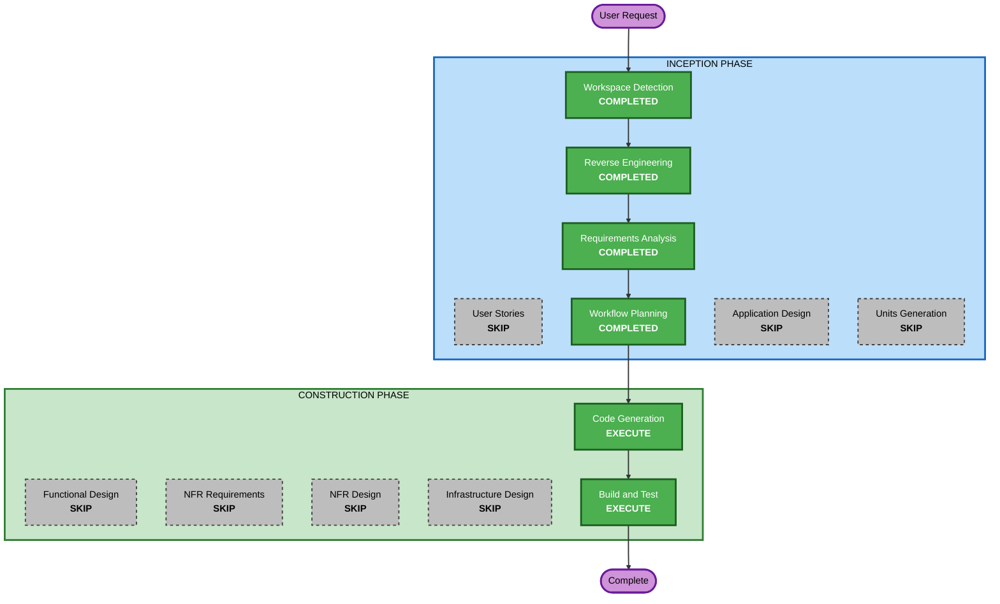

# Execution Plan

## Detailed Analysis Summary

### Transformation Scope

- **Transformation type**: Developer workflow and repository automation change.
- **Primary changes**: Define and support a GitFlow policy for Kotlin Spring
  Boot backend delivery.
- **Related components**: Backend contributor guidance, AI agent guidance, PR
  review guidance, GitHub workflow validation, and branch protection guidance.

### Change Impact Assessment

- **User-facing changes**: No direct product-user behavior change.
- **Structural changes**: No backend package or runtime architecture change is
  required by the approved requirements.
- **Data model changes**: None.
- **API changes**: None.
- **NFR impact**: Maintainability, traceability, and delivery safety improve
  when branch and PR rules become explicit.

### Component Relationships

- **Primary component**: Backend delivery workflow for Kotlin source under
  `src/`.
- **Repository support components**: `docs`, contributor instructions, PR
  template files, AI agent guidance, and GitHub workflow files when needed for
  backend GitFlow validation.
- **Out-of-scope components**: AI-DLC rule distribution release behavior and
  Python tooling release behavior unless a support file must mention the
  backend boundary.

### Risk Assessment

- **Risk level**: Medium.
- **Rollback complexity**: Moderate for workflow checks, easy for documentation
  and guidance files.
- **Testing complexity**: Moderate because some branch protection behavior can
  only be documented or validated through Git hosting settings.

## Workflow Visualization

Text alternative:

1. Workspace Detection, Reverse Engineering, Requirements Analysis, and
   Workflow Planning are complete.
2. User Stories, Application Design, and Units Generation are skipped because
   this request changes developer workflow guidance and automation rather than
   backend product behavior or component design.
3. Functional Design, NFR Requirements, NFR Design, and Infrastructure Design
   are skipped because no new domain model, service, infrastructure, or runtime
   NFR pattern is required.
4. Code Generation and Build and Test execute to plan, implement, and verify
   GitFlow documentation and automation support.

## Phases to Execute

### INCEPTION PHASE

- [x] Workspace Detection - Completed.
- [x] Reverse Engineering - Completed for the brownfield repository.
- [x] Requirements Analysis - Completed and approved.
- [x] User Stories - Skipped.
  - **Rationale**: Developer workflow and CI guidance work has no direct
    product-user journey.
- [x] Workflow Planning - Completed.
- [x] Application Design - Skipped.
  - **Rationale**: No new backend components, services, or business methods are
    required.
- [x] Units Generation - Skipped.
  - **Rationale**: The work can be implemented as one focused repository change
    sequence.

### CONSTRUCTION PHASE

- [x] Functional Design - Skipped.
  - **Rationale**: No new domain logic or data model is introduced.
- [x] NFR Requirements - Skipped.
  - **Rationale**: Requirements already capture delivery safety and
    maintainability constraints for the workflow change.
- [x] NFR Design - Skipped.
  - **Rationale**: No runtime NFR pattern design is required.
- [x] Infrastructure Design - Skipped.
  - **Rationale**: No cloud resource or deployment architecture design is
    required.
- [ ] Code Generation - Execute.
  - **Rationale**: AI-DLC must plan and implement the approved documentation,
    agent guidance, PR guidance, and feasible workflow validation changes.
- [ ] Build and Test - Execute.
  - **Rationale**: Markdown, workflow, and repository consistency checks are
    required after implementation.

### OPERATIONS PHASE

- [ ] Operations - Placeholder.
  - **Rationale**: AI-DLC operations workflow is not active for this request.

## Package Change Sequence

1. **Current guidance review** - Inspect contributing docs, PR template, agent
   guidance, and GitHub workflows for existing release and validation behavior.
2. **GitFlow policy documentation** - Add or update backend delivery guidance
   with branch roles, branch names, PR targets, release flow, hotfix flow, tags,
   and manual branch protection settings.
3. **Contributor and agent touchpoints** - Update the smallest set of
   contributor and AI guidance files that should point backend work toward the
   approved policy.
4. **Workflow validation** - Add or update feasible repository checks for
   backend GitFlow branch or PR flow without breaking AI-DLC release workflows.
5. **Verification** - Run Markdown and workflow-relevant validation and record
   any Git hosting settings that require manual configuration.

## Success Criteria

- Backend GitFlow policy is documented and reviewable from repository files.
- Guidance clearly separates backend delivery from unrelated AI-DLC rule
  distribution and script work.
- PR guidance points contributors toward the intended GitFlow base branches and
  review flow.
- Feasible committed automation supports or validates the approved flow.
- Non-versioned branch protection and required-check settings are explicitly
  documented when they cannot be committed.
- Existing uncommitted deployment changes are not overwritten.

## Estimated Timeline

- **Total remaining stages**: 2
- **Expected remaining path**: One Code Generation plan and implementation pass,
  followed by build and verification instructions.
