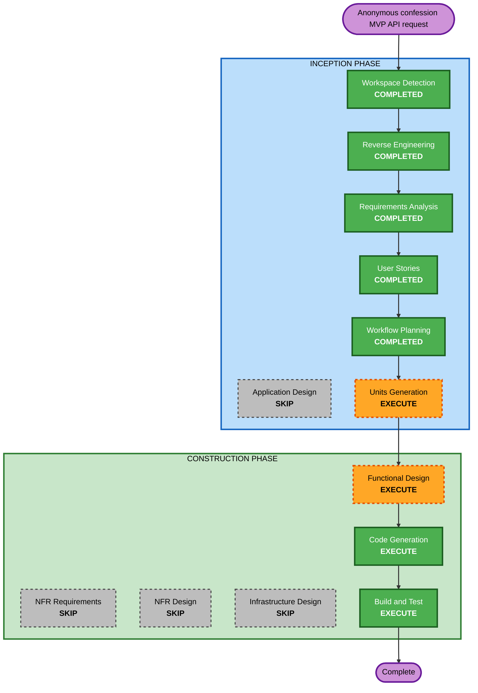

# Execution Plan

## Detailed Analysis Summary

### Transformation Scope

- **Transformation Type**: Focused brownfield API and application boundary
  change.
- **Primary Changes**: Complete the anonymous confession write flow and remove
  controller knowledge of the write command value object.
- **Related Components**: `confession/api`, `confession/application`,
  `author/application`, domain repository ports, infrastructure adapters, and
  focused backend tests.

### Change Impact Assessment

- **User-facing changes**: Yes. A first confession write from an anonymous
  device should proceed without a missing-author response.
- **Structural changes**: Yes, but constrained. The confession controller input
  boundary should stop constructing application write commands directly.
- **Data model changes**: No schema change is expected. The author record is
  reused as the existing anonymous device-backed identity store.
- **API changes**: Yes. The existing confession write endpoint behavior changes
  for previously unseen device ids while keeping `X-Device-Id` as the identity
  input.
- **NFR impact**: Limited. Existing validation and persistence boundaries must
  remain intact.

### Component Relationships

- **Primary Component**: Confession write flow.
- **Infrastructure Components**: Existing author and confession persistence
  adapters remain behind domain repository ports.
- **Shared Components**: Author application behavior provides lookup or
  creation for the confession write use case.
- **Dependent Components**: Confession HTTP clients depend on the write endpoint
  no longer requiring a pre-existing author for a valid first write.
- **Supporting Components**: Focused unit tests and Spring application smoke
  coverage.

### Risk Assessment

- **Risk Level**: Medium
- **Rollback Complexity**: Easy to moderate. The change is bounded to write
  orchestration and API input adaptation, but it touches a user-facing write
  path.
- **Testing Complexity**: Moderate. Existing-author and new-author branches
  plus the controller/use-case boundary need coverage.

## Workflow Visualization

Text alternative:

1. Completed inception context: workspace detection, reverse engineering,
   requirements analysis, and user stories.
2. Execute workflow planning approval, then units generation for one focused
   backend unit.
3. Execute functional design for the write-flow business and boundary rules.
4. Skip application design, NFR requirements, NFR design, and infrastructure
   design because no new service topology, stack choice, or infrastructure is
   required.
5. Execute code generation and build/test verification.

## Phases To Execute

### Inception Phase

- [x] Workspace Detection - Completed using the existing brownfield workspace.
- [x] Reverse Engineering - Existing artifacts reused.
- [x] Requirements Analysis - Anonymous confession MVP API requirements
  approved.
- [x] User Stories - Anonymous writer persona and write-flow story approved.
- [x] Workflow Planning - Execution plan prepared for review.
- [ ] Units Generation - EXECUTE
  - **Rationale**: The API change spans `author` and `confession` packages and
    should be captured as one explicit unit before construction.

### Construction Phase

- [ ] Functional Design - EXECUTE
  - **Rationale**: The first-write author auto-creation rule and
    controller/use-case boundary need concise design before code changes.
- [ ] Code Generation - EXECUTE
  - **Rationale**: The approved backend change must be implemented and tested.
- [ ] Build and Test - EXECUTE
  - **Rationale**: The changed API flow and package boundaries need build and
    focused test verification.

## Phases To Skip

- **Application Design**: Existing author and confession components already
  exist and no new service boundary is required.
- **NFR Requirements**: The requirements do not introduce new performance,
  security, scalability, or stack-selection concerns.
- **NFR Design**: Skipped because NFR Requirements is skipped.
- **Infrastructure Design**: Existing JPA adapters and deployment topology stay
  in place.

## Package Change Sequence

1. `confession/api` and confession application port boundary
   - Align the write use case input with the controller boundary requirement.
2. `author/application` and domain repository port usage
   - Keep anonymous author lookup or creation dependent on domain ports.
3. `confession/application`
   - Preserve write orchestration and explicit author id mapping.
4. Focused backend tests
   - Cover existing-author, auto-create-author, and controller-boundary
     behavior as needed.
5. Infrastructure review
   - Confirm JPA entities and Spring Data repositories remain infrastructure
     implementation details.

## Module Update Strategy

- **Update Approach**: Sequential within one backend unit.
- **Critical Path**: Use case input boundary and confession write orchestration.
- **Coordination Points**: `X-Device-Id` transport data, `AuthorRepository`
  port, confession write result mapping.
- **Testing Checkpoints**: Unit tests after use case changes, then project test
  suite or focused Gradle tests after API boundary changes.

## Success Criteria

- Valid first-write confession requests create missing anonymous authors and
  persist confessions.
- Existing anonymous authors are reused for later confession writes.
- The confession controller no longer constructs the write command value object
  directly.
- Application logic continues to depend on domain repository ports.
- JPA entities and Spring Data repositories remain in infrastructure.
- Focused tests cover changed behavior and verification results are recorded.
